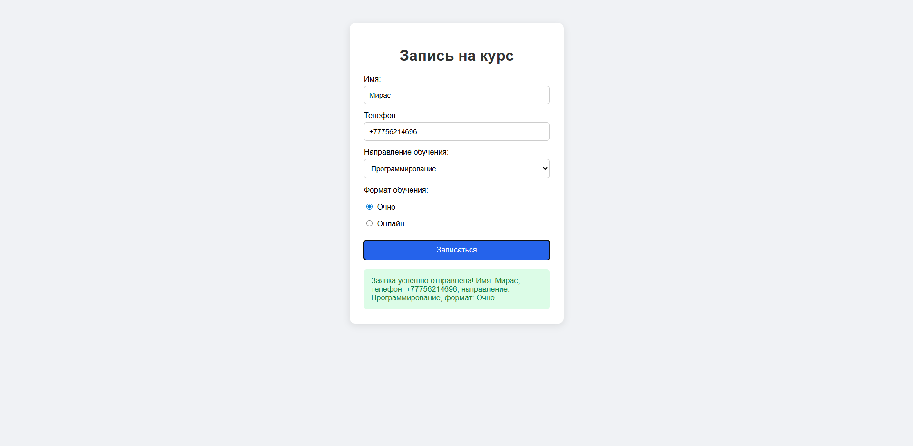
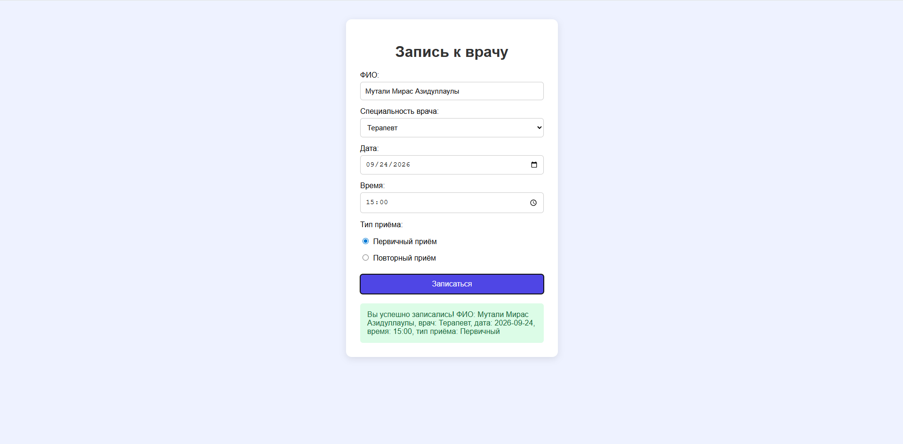
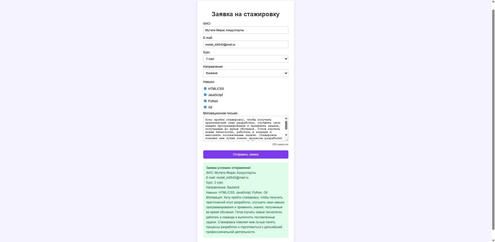

Лабораторная работа №4
HTML + JavaScript — Формы и валидация на стороне клиента

Дисциплина: Языки и технология программирования
Тема: Формы и валидация на стороне клиента
Варианты: 4, 11, 19

1. Цель работы

Создать HTML-формы и реализовать их клиентскую валидацию с помощью JavaScript без перезагрузки страницы.

Вариант 4. Форма записи на курс
Условие

Форма содержит имя, телефон, направление обучения и формат обучения. Необходимо проверить обязательность выбора.

Элементы формы

text — имя;

tel — телефон;

select — направление;

radio — формат обучения;

JavaScript — проверка заполнения.

index.html
<!DOCTYPE html>
<html lang="ru">
<head>
    <meta charset="UTF-8">
    <title>Запись на курс</title>
    <link rel="stylesheet" href="style.css">
</head>
<body>

    <h1>Запись на курс</h1>

    <form id="courseForm">
        <label for="name">Имя:</label>
        <input type="text" id="name" placeholder="Введите имя">

        <label for="phone">Телефон:</label>
        <input type="tel" id="phone" placeholder="+7 700 000 00 00">

        <label for="direction">Направление:</label>
        <select id="direction">
            <option value="">Выберите направление</option>
            <option value="Программирование">Программирование</option>
            <option value="Web-разработка">Web-разработка</option>
            <option value="Дизайн">Дизайн</option>
        </select>

        
Формат обучения:

        <label>
            <input type="radio" name="format" value="Очно">
            Очно
        </label>
        <label>
            <input type="radio" name="format" value="Онлайн">
            Онлайн
        </label>

        <button type="submit">Записаться</button>
    </form>

    

</body>
</html>

script.js
const courseForm = document.getElementById("courseForm");

courseForm.addEventListener("submit", function (event) {
    event.preventDefault();

    const name = document.getElementById("name").value.trim();
    const phone = document.getElementById("phone").value.trim();
    const direction = document.getElementById("direction").value;
    const format = document.querySelector('input[name="format"]:checked');
    const message = document.getElementById("message");

    if (name === "") {
        message.textContent = "Введите имя.";
        return;
    }

    if (phone === "") {
        message.textContent = "Введите телефон.";
        return;
    }

    if (direction === "") {
        message.textContent = "Выберите направление обучения.";
        return;
    }

    if (!format) {
        message.textContent = "Выберите формат обучения.";
        return;
    }

    message.textContent =
        `Запись выполнена: ${name}, ${direction}, ${format.value}.`;
});

Вариант 11. Форма записи к врачу
Условие

Форма содержит ФИО, специальность врача, дату, время и тип приёма. Необходимо проверить обязательные поля.

Элементы формы

text — ФИО;

select — специальность;

date — дата;

time — время;

radio — первичный/повторный приём.

HTML
<form id="doctorForm">
    <label for="fullName">ФИО:</label>
    <input type="text" id="fullName">

    <label for="doctor">Специальность:</label>
    <select id="doctor">
        <option value="">Выберите врача</option>
        <option value="Терапевт">Терапевт</option>
        <option value="Кардиолог">Кардиолог</option>
        <option value="Стоматолог">Стоматолог</option>
    </select>

    <label for="date">Дата:</label>
    <input type="date" id="date">

    <label for="time">Время:</label>
    <input type="time" id="time">

    
Тип приёма:

    <label>
        <input type="radio" name="visit" value="Первичный">
        Первичный
    </label>
    <label>
        <input type="radio" name="visit" value="Повторный">
        Повторный
    </label>

    <button type="submit">Записаться</button>
</form>

JavaScript
const doctorForm = document.getElementById("doctorForm");

doctorForm.addEventListener("submit", function (event) {
    event.preventDefault();

    const fullName = document.getElementById("fullName").value.trim();
    const doctor = document.getElementById("doctor").value;
    const date = document.getElementById("date").value;
    const time = document.getElementById("time").value;
    const visit = document.querySelector('input[name="visit"]:checked');
    const message = document.getElementById("doctorMessage");

    if (fullName === "") {
        message.textContent = "Введите ФИО.";
        return;
    }

    if (doctor === "") {
        message.textContent = "Выберите специальность врача.";
        return;
    }

    if (date === "") {
        message.textContent = "Выберите дату.";
        return;
    }

    if (time === "") {
        message.textContent = "Выберите время.";
        return;
    }

    if (!visit) {
        message.textContent = "Выберите тип приёма.";
        return;
    }

    message.textContent =
        `Запись подтверждена: ${fullName}, ${doctor}, ${date} ${time}.`;
});

Вариант 19. Форма заявки на стажировку
Условие

Форма содержит ФИО, e-mail, курс, направление, навыки и мотивационный текст. Необходимо выбрать минимум два навыка и проверить длину мотивационного текста.

Элементы формы

text — ФИО;

email — e-mail;

select — курс;

select — направление;

checkbox — навыки;

textarea — мотивационный текст.

HTML
<form id="internForm">
    <label for="internName">ФИО:</label>
    <input type="text" id="internName">

    <label for="email">E-mail:</label>
    <input type="email" id="email">

    <label for="course">Курс:</label>
    <select id="course">
        <option value="">Выберите курс</option>
        <option value="1">1 курс</option>
        <option value="2">2 курс</option>
        <option value="3">3 курс</option>
        <option value="4">4 курс</option>
    </select>

    <label for="direction2">Направление:</label>
    <select id="direction2">
        <option value="">Выберите направление</option>
        <option value="Frontend">Frontend</option>
        <option value="Backend">Backend</option>
        <option value="QA">QA</option>
        <option value="Data Science">Data Science</option>
    </select>

    
Навыки:

    <label>
        <input type="checkbox" name="skill" value="HTML/CSS">
        HTML/CSS
    </label>

    <label>
        <input type="checkbox" name="skill" value="JavaScript">
        JavaScript
    </label>

    <label>
        <input type="checkbox" name="skill" value="Python">
        Python
    </label>

    <label>
        <input type="checkbox" name="skill" value="Git">
        Git
    </label>

    <label for="motivation">Мотивационное письмо:</label>
    <textarea id="motivation" rows="5"
              placeholder="Минимум 50 символов"></textarea>

    
0 символов

    <button type="submit">Отправить заявку</button>
</form>

JavaScript
const internForm = document.getElementById("internForm");
const motivation = document.getElementById("motivation");
const counter = document.getElementById("counter");

motivation.addEventListener("input", function () {
    counter.textContent = `${motivation.value.length} символов`;
});

internForm.addEventListener("submit", function (event) {
    event.preventDefault();

    const name = document.getElementById("internName").value.trim();
    const email = document.getElementById("email").value.trim();
    const course = document.getElementById("course").value;
    const direction = document.getElementById("direction2").value;
    const text = motivation.value.trim();

    const skills = document.querySelectorAll(
        'input[name="skill"]:checked'
    );

    const message = document.getElementById("internMessage");

    if (name === "") {
        message.textContent = "Введите ФИО.";
        return;
    }

    if (email === "" || !email.includes("@")) {
        message.textContent = "Введите корректный e-mail.";
        return;
    }

    if (course === "") {
        message.textContent = "Выберите курс.";
        return;
    }

    if (direction === "") {
        message.textContent = "Выберите направление.";
        return;
    }

    if (skills.length < 2) {
        message.textContent = "Выберите минимум два навыка.";
        return;
    }

    if (text.length < 50) {
        message.textContent =
            "Мотивационный текст должен содержать минимум 50 символов.";
        return;
    }

    message.textContent = "Заявка на стажировку успешно отправлена.";
});

2. Общие стили
body {
    font-family: Arial, sans-serif;
    background: #f2f2f2;
    padding: 30px;
}

.container,
form {
    max-width: 500px;
    margin: auto;
    background: white;
    padding: 25px;
    border-radius: 10px;
}

h1 {
    text-align: center;
}

label {
    display: block;
    margin-top: 12px;
}

input,
select,
textarea,
button {
    width: 100%;
    box-sizing: border-box;
    margin-top: 5px;
    padding: 10px;
}

input[type="radio"],
input[type="checkbox"] {
    width: auto;
}

button {
    margin-top: 20px;
    background: #2563eb;
    color: white;
    border: none;
    border-radius: 5px;
    cursor: pointer;
}

button:hover {
    background: #1d4ed8;
}

p[id$="Message"] {
    text-align: center;
    color: #d00;
    font-weight: bold;
}

3. Тестирование
№	Вариант	Сценарий	Результат
1	4	Все поля заполнены	Успешная запись
2	4	Не указано имя	Сообщение «Введите имя»
3	4	Не выбран формат	Сообщение о выборе формата
4	11	Не выбрана дата	Сообщение о выборе даты
5	11	Все поля заполнены	Запись подтверждена
6	19	Выбран только один навык	Требуется минимум два навыка
7	19	Текст короче 50 символов	Ошибка длины текста
8	19	Все данные корректны	Заявка отправлена
4. Дополнительная интерактивность

В варианте 19 реализован счётчик символов мотивационного текста. При каждом вводе количество символов обновляется без перезагрузки страницы.

5. Контрольные вопросы
17. Что такое HTML-форма?

HTML-форма — элемент страницы для ввода и отправки данных пользователя.

18. Для чего используются input, select и button?

input используется для ввода данных, select — для выбора значения из списка, button — для выполнения действия, например отправки формы.

19. Чем checkbox отличается от radio?

checkbox позволяет выбрать несколько вариантов, а radio — один вариант из группы.

20. Что такое клиентская валидация?

Проверка введённых данных непосредственно в браузере до отправки на сервер.

21. Для чего используется событие submit?

Оно возникает при отправке формы и позволяет выполнить дополнительную обработку данных.

22. Что делает event.preventDefault()?

Отменяет стандартное действие браузера, например перезагрузку страницы после отправки формы.

23. Как получить значение текстового поля?
const value = document.getElementById("name").value;

24. Как проверить состояние checkbox?
checkbox.checked

25. Как получить выбранное значение select?
const value = document.getElementById("course").value;

26. Почему клиентская валидация не заменяет серверную?

Потому что JavaScript выполняется на стороне пользователя и его проверки можно обойти. Сервер должен самостоятельно проверять полученные данные.

27. Как сделать сообщение об ошибке понятным?

Нужно указать конкретное поле и действие, которое должен выполнить пользователь, например: «Выберите направление обучения».

28. Какие тестовые случаи следует проверить?

Нужно проверить корректное заполнение формы, пустые обязательные поля, неправильные значения, отсутствие выбора radio/checkbox, граничные значения и успешную отправку.

6. Вывод

В ходе лабораторной работы были разработаны HTML-формы для вариантов 4, 11 и 19. С помощью JavaScript реализована клиентская валидация текстовых полей, select, radio и checkbox. Для варианта 19 дополнительно реализован счётчик символов мотивационного текста. Формы проверяются без перезагрузки страницы.